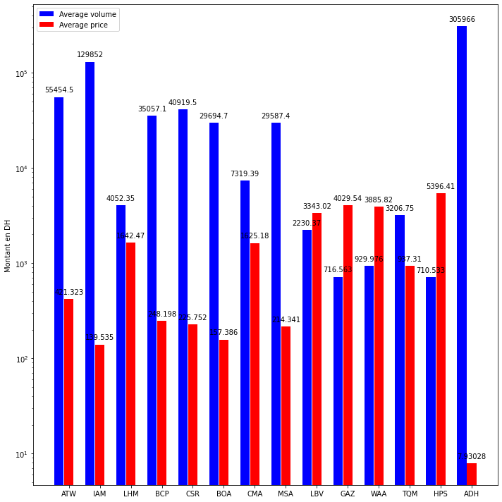
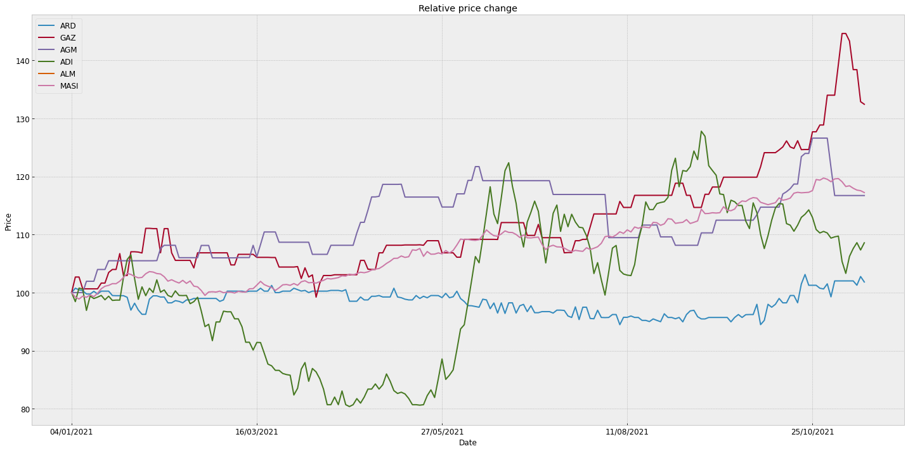

by <a href="https://www.linkedin.com/in/Rhzif/" target="_blank">Yassine Rhzif</a> and <a href="https://www.linkedin.com/in/ahmed-ouaboune/" target="_blank">Ahmed Ouaboune</a>

Casabourselib est un package Python que j'ai crée avec mon collègue Ahmed. lors de nos travaux sur d'autres projets concernant la bourse de Casablanca, nous avons réalisé la difficulté d'obtenir des données à partir du site web officiel de la bourse. nous avons donc eu l'idée de créer un package qui permet d'obtenir des données d'actions cotée en bourse de manière instantanée et en quelques secondes, similairement au package de Yahoo Finance (yfinance).

```python
#pour installer le package veuillez ouvrir votre ligne de commands "CMD" et tapez le code suivant 
pip install Casabourselib
```


```python
#c'est comme ca vous pouvez importer le package Casabourselib
#vous pouvez utilisez n'import quoi a la place de 'cbl' mais fait attention de l'utiliser lorsque vous appellez les fonctions 
import Casabourselib  as cbl
```


```python
#cette fonction donne le symbole (Ticker) de chaque entreprise cotée en bourse de casablanca
get_tickers()
```


```python
#exemple d'appel:
cbl.get_tickers()
```


<div>

<table border="1" class="dataframe">
  <thead>
    <tr style="text-align: right;">
      <th></th>
      <th>Titre</th>
      <th>Ticker</th>
    </tr>
  </thead>
  <tbody>
    <tr>
      <th>0</th>
      <td>Addoha</td>
      <td>ADH</td>
    </tr>
    <tr>
      <th>1</th>
      <td>AFMA</td>
      <td>AFM</td>
    </tr>
    <tr>
      <th>2</th>
      <td>Afric Indus.</td>
      <td>AFI</td>
    </tr>
    <tr>
      <th>3</th>
      <td>Afriquia Gaz</td>
      <td>GAZ</td>
    </tr>
    <tr>
      <th>4</th>
      <td>Agma</td>
      <td>AGM</td>
    </tr>
    <tr>
      <th>...</th>
      <td>...</td>
      <td>...</td>
    </tr>
    <tr>
      <th>71</th>
      <td>Timar</td>
      <td>TIM</td>
    </tr>
    <tr>
      <th>72</th>
      <td>TotalMaroc</td>
      <td>TMA</td>
    </tr>
    <tr>
      <th>73</th>
      <td>Unimer</td>
      <td>UMR</td>
    </tr>
    <tr>
      <th>74</th>
      <td>WAFA ASSURANCE</td>
      <td>WAA</td>
    </tr>
    <tr>
      <th>75</th>
      <td>Zellidja</td>
      <td>ZDJ</td>
    </tr>
  </tbody>
</table>
<p>76 rows × 2 columns</p>
</div>


```python
#cette fonction donne le Cour de chaque entreprise cotée en bourse de casablanca
get_price(ticker, start_date, end_date)
```


```python
#exemple d'appel: 
cbl.get_price('CIH', '01/01/2017', '18/10/2021')
#Resultat:
```


<div>

<table border="1" class="dataframe">
  <thead>
    <tr style="text-align: right;">
      <th></th>
      <th>value</th>
      <th>min</th>
      <th>max</th>
      <th>variation</th>
      <th>volume</th>
    </tr>
    <tr>
      <th>date</th>
      <th></th>
      <th></th>
      <th></th>
      <th></th>
      <th></th>
    </tr>
  </thead>
  <tbody>
    <tr>
      <th>02/01/2017</th>
      <td>NaN</td>
      <td>NaN</td>
      <td>NaN</td>
      <td>-100.00</td>
      <td>NaN</td>
    </tr>
    <tr>
      <th>03/01/2017</th>
      <td>310.00</td>
      <td>300.00</td>
      <td>310.00</td>
      <td>3.33</td>
      <td>347.0</td>
    </tr>
    <tr>
      <th>04/01/2017</th>
      <td>305.40</td>
      <td>302.00</td>
      <td>310.00</td>
      <td>-1.48</td>
      <td>36480.0</td>
    </tr>
    <tr>
      <th>05/01/2017</th>
      <td>311.00</td>
      <td>306.15</td>
      <td>315.00</td>
      <td>1.83</td>
      <td>14916.0</td>
    </tr>
    <tr>
      <th>06/01/2017</th>
      <td>325.00</td>
      <td>320.00</td>
      <td>330.00</td>
      <td>4.50</td>
      <td>128910.0</td>
    </tr>
    <tr>
      <th>...</th>
      <td>...</td>
      <td>...</td>
      <td>...</td>
      <td>...</td>
      <td>...</td>
    </tr>
    <tr>
      <th>12/10/2021</th>
      <td>315.10</td>
      <td>315.00</td>
      <td>323.00</td>
      <td>-0.91</td>
      <td>749.0</td>
    </tr>
    <tr>
      <th>13/10/2021</th>
      <td>320.00</td>
      <td>315.10</td>
      <td>320.00</td>
      <td>1.56</td>
      <td>5542.0</td>
    </tr>
    <tr>
      <th>14/10/2021</th>
      <td>320.00</td>
      <td>317.00</td>
      <td>320.00</td>
      <td>0.00</td>
      <td>1047.0</td>
    </tr>
    <tr>
      <th>15/10/2021</th>
      <td>320.95</td>
      <td>314.00</td>
      <td>321.85</td>
      <td>0.30</td>
      <td>2703.0</td>
    </tr>
    <tr>
      <th>18/10/2021</th>
      <td>325.00</td>
      <td>316.00</td>
      <td>325.00</td>
      <td>1.26</td>
      <td>31831.0</td>
    </tr>
  </tbody>
</table>
<p>1189 rows × 5 columns</p>
</div>


```python
#vous pouvez egalement donner l'ISIN a la place de ticker comme argument 
cbl.get_stock_price('MA0000011454', '01/01/2017', '18/10/2021')
```


```python
#vous pouvez aussi dommander les donnée de l'indice MASI ou MADEX 
cbl.get_price('MASI', '01/01/2017', '18/10/2021')
#Resultat:
```


<div>

<table border="1" class="dataframe">
  <thead>
    <tr style="text-align: right;">
      <th></th>
      <th>value</th>
    </tr>
    <tr>
      <th>date</th>
      <th></th>
    </tr>
  </thead>
  <tbody>
    <tr>
      <th>02/01/2017</th>
      <td>11564.7175</td>
    </tr>
    <tr>
      <th>03/01/2017</th>
      <td>11644.2120</td>
    </tr>
    <tr>
      <th>04/01/2017</th>
      <td>11826.7288</td>
    </tr>
    <tr>
      <th>05/01/2017</th>
      <td>12186.1188</td>
    </tr>
    <tr>
      <th>06/01/2017</th>
      <td>12532.2174</td>
    </tr>
    <tr>
      <th>...</th>
      <td>...</td>
    </tr>
    <tr>
      <th>12/10/2021</th>
      <td>13160.5647</td>
    </tr>
    <tr>
      <th>13/10/2021</th>
      <td>13187.7301</td>
    </tr>
    <tr>
      <th>14/10/2021</th>
      <td>13283.1536</td>
    </tr>
    <tr>
      <th>15/10/2021</th>
      <td>13300.9307</td>
    </tr>
    <tr>
      <th>18/10/2021</th>
      <td>13290.6320</td>
    </tr>
  </tbody>
</table>
<p>1191 rows × 1 columns</p>
</div>


```python
#vous pouvez egalement donner une liste de tickers a la place d'un seul comme argument a la fonction 
cbl.get_price(['CIH','IAM','MASI','MADEX'], '01/01/2017', '18/10/2021')
#Resultat:
```


<div>

<table border="1" class="dataframe">
  <thead>
    <tr style="text-align: right;">
      <th></th>
      <th>CIH</th>
      <th>IAM</th>
      <th>MASI</th>
      <th>MADEX</th>
    </tr>
    <tr>
      <th>date</th>
      <th></th>
      <th></th>
      <th></th>
      <th></th>
    </tr>
  </thead>
  <tbody>
    <tr>
      <th>02/01/2017</th>
      <td>NaN</td>
      <td>140.40</td>
      <td>11564.7175</td>
      <td>9476.3004</td>
    </tr>
    <tr>
      <th>03/01/2017</th>
      <td>310.00</td>
      <td>142.25</td>
      <td>11644.2120</td>
      <td>9547.9921</td>
    </tr>
    <tr>
      <th>04/01/2017</th>
      <td>305.40</td>
      <td>145.00</td>
      <td>11826.7288</td>
      <td>9706.8093</td>
    </tr>
    <tr>
      <th>05/01/2017</th>
      <td>311.00</td>
      <td>148.20</td>
      <td>12186.1188</td>
      <td>10021.0194</td>
    </tr>
    <tr>
      <th>06/01/2017</th>
      <td>325.00</td>
      <td>150.00</td>
      <td>12532.2174</td>
      <td>10315.1171</td>
    </tr>
    <tr>
      <th>...</th>
      <td>...</td>
      <td>...</td>
      <td>...</td>
      <td>...</td>
    </tr>
    <tr>
      <th>12/10/2021</th>
      <td>315.10</td>
      <td>141.25</td>
      <td>13160.5647</td>
      <td>10683.0114</td>
    </tr>
    <tr>
      <th>13/10/2021</th>
      <td>320.00</td>
      <td>142.00</td>
      <td>13187.7301</td>
      <td>10707.8966</td>
    </tr>
    <tr>
      <th>14/10/2021</th>
      <td>320.00</td>
      <td>142.80</td>
      <td>13283.1536</td>
      <td>10787.8802</td>
    </tr>
    <tr>
      <th>15/10/2021</th>
      <td>320.95</td>
      <td>143.20</td>
      <td>13300.9307</td>
      <td>10798.7228</td>
    </tr>
    <tr>
      <th>18/10/2021</th>
      <td>325.00</td>
      <td>142.95</td>
      <td>13290.6320</td>
      <td>10794.0268</td>
    </tr>
  </tbody>
</table>
<p>1189 rows × 4 columns</p>
</div>


```python
#Cette fonction donne les dividendes distribués de chaque entreprise cotée en bourse
get_dividends(ticker)
```


```python
#exemple d'appel :
cbl.get_dividends('IAM')
#Resultat:
```


<div>

<table border="1" class="dataframe">
  <thead>
    <tr style="text-align: right;">
      <th></th>
      <th>Dividende Ordinaire</th>
      <th>Date de détachement</th>
      <th>Date de paiement</th>
      <th>Dividende Exceptionnel</th>
      <th>Date de détachement.1</th>
      <th>Date de paiement.1</th>
    </tr>
    <tr>
      <th>Année</th>
      <th></th>
      <th></th>
      <th></th>
      <th></th>
      <th></th>
      <th></th>
    </tr>
  </thead>
  <tbody>
    <tr>
      <th>2020</th>
      <td>4.01</td>
      <td>06/09/2021</td>
      <td>15/09/2021</td>
      <td>-</td>
      <td>-</td>
      <td>-</td>
    </tr>
    <tr>
      <th>2019</th>
      <td>5.54</td>
      <td>03/08/2020</td>
      <td>12/08/2020</td>
      <td>-</td>
      <td>-</td>
      <td>-</td>
    </tr>
    <tr>
      <th>2018</th>
      <td>6.83</td>
      <td>24/05/2019</td>
      <td>04/06/2019</td>
      <td>-</td>
      <td>-</td>
      <td>-</td>
    </tr>
    <tr>
      <th>2017</th>
      <td>6.48</td>
      <td>25/05/2018</td>
      <td>05/06/2018</td>
      <td>-</td>
      <td>-</td>
      <td>-</td>
    </tr>
    <tr>
      <th>2016</th>
      <td>6.36</td>
      <td>24/05/2017</td>
      <td>02/06/2017</td>
      <td>-</td>
      <td>-</td>
      <td>-</td>
    </tr>
    <tr>
      <th>2015</th>
      <td>6.36</td>
      <td>24/05/2016</td>
      <td>02/06/2016</td>
      <td>-</td>
      <td>-</td>
      <td>-</td>
    </tr>
    <tr>
      <th>2014</th>
      <td>6.90</td>
      <td>22/05/2015</td>
      <td>02/06/2015</td>
      <td>-</td>
      <td>-</td>
      <td>-</td>
    </tr>
    <tr>
      <th>2013</th>
      <td>6.00</td>
      <td>23/05/2014</td>
      <td>03/06/2014</td>
      <td>-</td>
      <td>-</td>
      <td>-</td>
    </tr>
    <tr>
      <th>2012</th>
      <td>7.40</td>
      <td>23/05/2013</td>
      <td>03/06/2013</td>
      <td>-</td>
      <td>-</td>
      <td>-</td>
    </tr>
    <tr>
      <th>2011</th>
      <td>9.26</td>
      <td>22/05/2012</td>
      <td>31/05/2012</td>
      <td>-</td>
      <td>-</td>
      <td>-</td>
    </tr>
    <tr>
      <th>2010</th>
      <td>10.58</td>
      <td>20/05/2011</td>
      <td>31/05/2011</td>
      <td>-</td>
      <td>-</td>
      <td>-</td>
    </tr>
    <tr>
      <th>2009</th>
      <td>10.31</td>
      <td>24/05/2010</td>
      <td>02/06/2010</td>
      <td>-</td>
      <td>-</td>
      <td>-</td>
    </tr>
    <tr>
      <th>2008</th>
      <td>10.83</td>
      <td>25/05/2009</td>
      <td>03/06/2009</td>
      <td>-</td>
      <td>-</td>
      <td>-</td>
    </tr>
    <tr>
      <th>2007</th>
      <td>9.20</td>
      <td>19/05/2008</td>
      <td>28/05/2008</td>
      <td>-</td>
      <td>-</td>
      <td>-</td>
    </tr>
    <tr>
      <th>2006</th>
      <td>7.88</td>
      <td>15/05/2007</td>
      <td>15/05/2007</td>
      <td>-</td>
      <td>-</td>
      <td>-</td>
    </tr>
    <tr>
      <th>2005</th>
      <td>6.96</td>
      <td>02/05/2006</td>
      <td>02/05/2006</td>
      <td>-</td>
      <td>-</td>
      <td>-</td>
    </tr>
    <tr>
      <th>2004</th>
      <td>5.00</td>
      <td>04/05/2005</td>
      <td>04/05/2005</td>
      <td>-</td>
      <td>-</td>
      <td>-</td>
    </tr>
    <tr>
      <th>2003</th>
      <td>5.83</td>
      <td>04/06/2004</td>
      <td>04/06/2004</td>
      <td>-</td>
      <td>-</td>
      <td>-</td>
    </tr>
  </tbody>
</table>
</div>


```python
#Cette fonction donne les différents indicateurs économique de chaque entreprise cotée en bourse
get_indicators(ticker)
```


```python
#exemple d'appel :
cbl.get_indicators('CIH')
#Resultat:
```


<div>

<table border="1" class="dataframe">
  <thead>
    <tr style="text-align: right;">
      <th></th>
      <th>2020</th>
      <th>2019</th>
      <th>2018</th>
    </tr>
    <tr>
      <th>Chiffres</th>
      <th></th>
      <th></th>
      <th></th>
    </tr>
  </thead>
  <tbody>
    <tr>
      <th>Comptes consolidés</th>
      <td>Oui</td>
      <td>Oui</td>
      <td>Oui</td>
    </tr>
    <tr>
      <th>Capital social (2)</th>
      <td>2 832 473 500</td>
      <td>2 832 473 500</td>
      <td>2 660 808 500</td>
    </tr>
    <tr>
      <th>Capitaux propres (3)</th>
      <td>5 424 245 000</td>
      <td>5 487 522 000</td>
      <td>5 121 960 000</td>
    </tr>
    <tr>
      <th>Nombre titres(2)</th>
      <td>28 324 735</td>
      <td>28 324 735</td>
      <td>26 608 085</td>
    </tr>
    <tr>
      <th>Produit Net bancaire</th>
      <td>2 759 674 000</td>
      <td>2 501 863 000</td>
      <td>2 248 842 000</td>
    </tr>
    <tr>
      <th>Résultat d'exploitation</th>
      <td>67 190 000</td>
      <td>691 771 000</td>
      <td>603 042 000</td>
    </tr>
    <tr>
      <th>Résultat net (4)</th>
      <td>80 655 000</td>
      <td>426 382 000</td>
      <td>455 043 000</td>
    </tr>
    <tr>
      <th>BPA</th>
      <td>2.85</td>
      <td>15.05</td>
      <td>17.10</td>
    </tr>
    <tr>
      <th>ROE (en %)</th>
      <td>1.49</td>
      <td>7.77</td>
      <td>8.88</td>
    </tr>
    <tr>
      <th>Payout (en %)</th>
      <td>-</td>
      <td>93.00</td>
      <td>81.86</td>
    </tr>
    <tr>
      <th>Dividend yield (en %)</th>
      <td>-</td>
      <td>4.68</td>
      <td>4.67</td>
    </tr>
    <tr>
      <th>PER</th>
      <td>89.55</td>
      <td>19.86</td>
      <td>17.54</td>
    </tr>
    <tr>
      <th>PBR</th>
      <td>1.33</td>
      <td>1.54</td>
      <td>1.56</td>
    </tr>
  </tbody>
</table>
</div>


```python
#cette fonction donne la composition de l'indice Masi avec le poid, capitalisation et le facteur flottant de chaque titre.
get_masi_data()
```


```python
#exemple d'appel :
cbl.get_masi_data()
#Resultat:
```


<div>

<table border="1" class="dataframe">
  <thead>
    <tr style="text-align: right;">
      <th></th>
      <th></th>
      <th>Code Isin</th>
      <th></th>
      <th>Instrument</th>
      <th></th>
      <th>Nombre de titres</th>
      <th></th>
      <th>Cours</th>
      <th></th>
      <th>Facteur flottant</th>
      <th></th>
      <th>Facteur de plafonnement</th>
      <th></th>
      <th>Capitalisation flottante</th>
      <th></th>
      <th>Poids</th>
      <th></th>
    </tr>
  </thead>
  <tbody>
    <tr>
      <th>0</th>
      <td></td>
      <td>MA0000012445</td>
      <td></td>
      <td>ATTIJARIWAFA BANK</td>
      <td></td>
      <td>215 140 839</td>
      <td></td>
      <td>481,10</td>
      <td></td>
      <td>0,30</td>
      <td></td>
      <td>1,00</td>
      <td></td>
      <td>31 051 277 292,87</td>
      <td></td>
      <td>0,1801</td>
      <td></td>
    </tr>
    <tr>
      <th>1</th>
      <td></td>
      <td>MA0000011488</td>
      <td></td>
      <td>ITISSALAT AL-MAGHRIB</td>
      <td></td>
      <td>879 095 340</td>
      <td></td>
      <td>141,65</td>
      <td></td>
      <td>0,20</td>
      <td></td>
      <td>1,00</td>
      <td></td>
      <td>24 904 770 982,20</td>
      <td></td>
      <td>0,1444</td>
      <td></td>
    </tr>
    <tr>
      <th>2</th>
      <td></td>
      <td>MA0000012320</td>
      <td></td>
      <td>LAFARGEHOLCIM MAR</td>
      <td></td>
      <td>23 431 240</td>
      <td></td>
      <td>2174,00</td>
      <td></td>
      <td>0,30</td>
      <td></td>
      <td>1,00</td>
      <td></td>
      <td>15 281 854 728,00</td>
      <td></td>
      <td>0,0886</td>
      <td></td>
    </tr>
    <tr>
      <th>3</th>
      <td></td>
      <td>MA0000011884</td>
      <td></td>
      <td>BCP</td>
      <td></td>
      <td>203 312 473</td>
      <td></td>
      <td>278,00</td>
      <td></td>
      <td>0,20</td>
      <td></td>
      <td>1,00</td>
      <td></td>
      <td>11 304 173 498,80</td>
      <td></td>
      <td>0,0655</td>
      <td></td>
    </tr>
    <tr>
      <th>4</th>
      <td></td>
      <td>MA0000012247</td>
      <td></td>
      <td>COSUMAR</td>
      <td></td>
      <td>94 487 143</td>
      <td></td>
      <td>262,10</td>
      <td></td>
      <td>0,40</td>
      <td></td>
      <td>1,00</td>
      <td></td>
      <td>9 906 032 072,12</td>
      <td></td>
      <td>0,0574</td>
      <td></td>
    </tr>
    <tr>
      <th>...</th>
      <td>...</td>
      <td>...</td>
      <td>...</td>
      <td>...</td>
      <td>...</td>
      <td>...</td>
      <td>...</td>
      <td>...</td>
      <td>...</td>
      <td>...</td>
      <td>...</td>
      <td>...</td>
      <td>...</td>
      <td>...</td>
      <td>...</td>
      <td>...</td>
      <td>...</td>
    </tr>
    <tr>
      <th>70</th>
      <td></td>
      <td>MA0000011686</td>
      <td></td>
      <td>TIMAR</td>
      <td></td>
      <td>301 100</td>
      <td></td>
      <td>142,00</td>
      <td></td>
      <td>0,20</td>
      <td></td>
      <td>1,00</td>
      <td></td>
      <td>8 551 240,00</td>
      <td></td>
      <td>0,0000</td>
      <td></td>
    </tr>
    <tr>
      <th>71</th>
      <td></td>
      <td>MA0000011132</td>
      <td></td>
      <td>IB MAROC.COM</td>
      <td></td>
      <td>417 486</td>
      <td></td>
      <td>37,03</td>
      <td></td>
      <td>0,45</td>
      <td></td>
      <td>1,00</td>
      <td></td>
      <td>6 956 777,96</td>
      <td></td>
      <td>0,0000</td>
      <td></td>
    </tr>
    <tr>
      <th>72</th>
      <td></td>
      <td>MA0000010571</td>
      <td></td>
      <td>ZELLIDJA S.A</td>
      <td></td>
      <td>572 849</td>
      <td></td>
      <td>87,00</td>
      <td></td>
      <td>0,10</td>
      <td></td>
      <td>1,00</td>
      <td></td>
      <td>4 983 786,30</td>
      <td></td>
      <td>0,0000</td>
      <td></td>
    </tr>
    <tr>
      <th>73</th>
      <td></td>
      <td>MA0000010993</td>
      <td></td>
      <td>REBAB COMPANY</td>
      <td></td>
      <td>176 456</td>
      <td></td>
      <td>109,95</td>
      <td></td>
      <td>0,20</td>
      <td></td>
      <td>1,00</td>
      <td></td>
      <td>3 880 267,44</td>
      <td></td>
      <td>0,0000</td>
      <td></td>
    </tr>
    <tr>
      <th>74</th>
      <td></td>
      <td></td>
      <td></td>
      <td>Total</td>
      <td></td>
      <td>2 680 176 515,00</td>
      <td></td>
      <td></td>
      <td></td>
      <td></td>
      <td></td>
      <td></td>
      <td></td>
      <td>172 458 892 465,18</td>
      <td></td>
      <td></td>
      <td></td>
    </tr>
  </tbody>
</table>
<p>75 rows × 17 columns</p>
</div>


```python
#La meme chose pour cette fonction, elle donne la composition de l'indice Madex avec les poids, capitalisation et le facteur flottant de chaque titre.
get_madex_data()
#exemple d'appel :
cbl.get_madex_data()
#Le resultat est presque similaire au resultat de Masi 
```


```python
#importation des package qu'on va utiliser pour la visualisation et le traitement des données 
import Casabourselib as cbl
import pandas as pd 
import matplotlib.pyplot as plt
import numpy as np
```


```python
top13 = ['ATW','IAM','LHM','BCP','CSR','BOA','CMA','MSA','LBV','GAZ','WAA','TQM','HPS', 'ADH']
average_volume = []
average_price = []
for ticker in top13:
  df = cbl.get_price(ticker,'01/01/2020','15/11/2021')
  temp1 = df.volume.mean()
  temp2 = df.value.mean()
  average_volume.append(temp1)
  average_price.append(temp2)

labels = top13

x = np.arange(len(labels))  # the label locations
width = 0.3  # the width of the bars

fig, ax = plt.subplots(figsize=(10,10))
plt.yscale('log')
fig.set_facecolor('white')

rects1 = ax.bar(x-0.32, average_volume, width=0.3, color='b', align='center', label='Average volume')
rects2 = ax.bar(x, average_price, width=0.3, color='r', align='center', label='Average price')

# Add some text for labels, title and custom x-axis tick labels, etc.
ax.set_ylabel('Montant en DH')
ax.set_xticks(x)
ax.set_xticklabels(labels)
ax.legend()
ax.bar_label(rects1, padding=5)
ax.bar_label(rects2, padding=5)
fig.tight_layout()
plt.show()

```





```python
masi = cbl.get_masi_data()
total = float(masi['Capitalisation flottante'][74].replace(',','.').replace(' ',''))
slices = [] 
labels = []
codes_isin = []
for i in range(0,74) : 
  cap = float(masi['Capitalisation flottante'][i].replace(',','.').replace(' ',''))
  slices.append(cap/total)
  codes_isin.append(masi['Code Isin'][i])
  
for code in codes_isin:
  labels.append(str(cbl.ticker_2_isin(code)))

other = slices[13:76]
sum_other = sum(other)
slices = slices[0:13]
slices.append(sum_other)
labels = labels[0:13]
labels.append('Autres')

fig = plt.figure(figsize=[10, 10])
fig.set_facecolor('white')
ax = fig.add_subplot(111)
explode = (0, 0, 0, 0, 0, 0, 0, 0, 0, 0, 0, 0, 0, 0.05)  
ax.pie(slices,explode = explode, labels=labels, labeldistance=1.1, autopct='%1.1f%%',pctdistance=0.9,
        shadow=True, startangle=0);
plt.show()
```


```python
df = cbl.get_price(['ARD','GAZ','AGM','ADI','ALM','MASI'], '01/01/2021', '12/11/2021')
returns = df.apply(lambda x: (x / x[0] * 100))
ax = returns.plot(title='Relative price change', fontsize=12, figsize=(20, 10))
ax.set_xlabel("Date")
ax.set_ylabel("Price")
plt.title('Relative price change')
plt.legend(loc='upper left', fontsize=12)
plt.tight_layout()
plt.style.use('bmh')
plt.grid(True)
plt.show()
```




